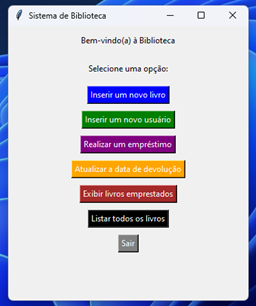
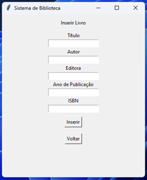
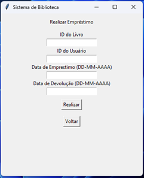
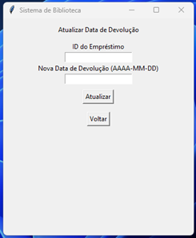
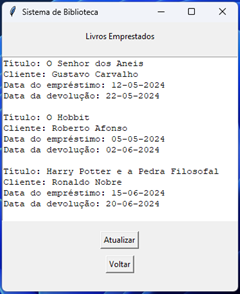

#📖 Sistema de Biblioteca em Python

O desenvolvimento deste projeto envolve a criação de uma aplicação de sistema de gerenciamento de biblioteca utilizando Python com o módulo Tkinter para a interface gráfica e SQLite como sistema de gestão de banco de dados.

Foi o escolhido o Tkinter por conta da eficiencia e simplicidade para de interface gráfica

•	Menu Principal: Serve como um ponto de partida, onde o usuário pode navegar para diferentes funcionalidades do sistema como a inserção de livros, usuários, realização de empréstimos etc.

•	Inserção de Livros e Usuários: Estes frames permitem o cadastro de novos livros e usuários no sistema, solicitando informações como título, autor, editora para livros e nome, endereço, e-mail para usuários.

•	Gestão de Empréstimos: Inclui funcionalidades para registrar novos empréstimos e atualizar datas de devolução. O sistema permite a entrada de datas e associação entre livros e usuários.

•	Consulta de Livros Emprestados e Lista de Livros: Oferecem a visualização de livros atualmente emprestados e de todos os livros registrados na biblioteca, respectivamente.

🎲 Integração com o Banco de Dados

Utilizando SQLite, um sistema de gestão de banco de dados bem leve, o sistema armazena e recupera dados de livros, usuários e empréstimos. A escolha de banco de dados foi para o SQLite por conta da sua facilidade na configuração e capacidade de atender às necessidades de aplicações de menor escala sem a necessidade de um servidor de banco de dados dedicado.

